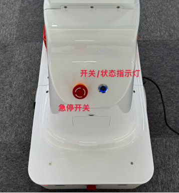
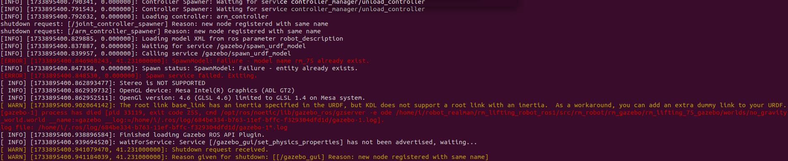

## 1.整体机器人介绍

### 项目概述

本项目开发并集成了一个基于 ROS1 的具身双臂机器人功能包，包含双臂机械臂、视觉传感器和头部舵机控制模块，适用于智能制造、服务机器人和科研实验等场景。功能包提供各模块的驱动、控制及使用案例，并包含一个调用外部移动底盘服务的示例，支持开发者快速上手和二次开发。

### 系统组成

- **双臂机械臂模块**：搭配两台7/6轴机械臂，具备单臂独立操作和双臂协同操作能力。
- **视觉传感器模块**：支持 Intel RealSense D435 相机和 USB 相机，提供多相机并行采集功能。D435 相机支持深度图像（Z16 格式）和 RGB 图像（BGR8 格式）发布，适用于环境感知、物体识别和定位；USB 相机支持 RGB 图像发布，适用于基本视觉任务。
- **头部舵机模块**：通过 LX-224HV 舵机控制，灵活调整机器人视角，增强环境观测能力。。
- **底盘服务调用示例**：提供一个调用外部移动底盘（悟时 AGV）服务的 demo，底盘 ROS 包部署于其自身开发板。


## 2.硬件简单介绍

机器人主要部分如表格所示

| 部件名称         | 硬件版本信息                                                 | 软件版本信息                 |
| ---------------- | ------------------------------------------------------------ | ---------------------------- |
| 机械臂           | rm75-B/rm65-B                                                | 控制器V1.7.0，ROS功能包V2.40 |
| 相机             | Realsense D435C                                              | realsense-ros-2.3.2          |
| 主控             | jetson xavier NX                                             | ubuntu20.04 、ros-noetic     |
| 底盘             | 悟时                                                         |                              |
| 头部舵机         | LX-224HV 1                                                   | 串口通信                     |
| 末端工具（可选） | RMG24平行夹爪/灵巧手（右手RM56DFX-2R/左手RM56DFX-2L/傲翼™（OHand™） |                              |

## 3.安全说明

### 3.1 急停开关

急停开关用于机械臂的紧急制动，使用前应检查急停开关状态：

- 如果处于按下状态，请顺时针旋转按钮使按钮弹起
- 然后按下机器人背部开机按钮
- 正常开机后，背部状态指示灯将变为蓝色



> **警告**: 操作机器人前，请确保您已了解急停开关的位置和使用方法，以便在紧急情况下快速响应。

## 4.软件包整体介绍

本 ROS1 包为 ROS Noetic 环境下的具身双臂机器人提供了全面的控制框架，支持 RM65/RM75 机械臂、RealSense D435 相机、USB 相机、头部舵机和移动底盘。包分为两部分：**机器人功能包**提供核心功能，**示例包**用于演示和测试。

### 4.1 机器人功能包

功能包为机器人各组件提供核心控制功能。详细使用说明请参阅每个包目录中的文档（例如 `src/embodied_arm/embodied_arm_driver/ros1具身双臂机器人embodied_arm_driver功能包详解.md`）。

#### 4.1.1 [机械臂相关功能包](./src/embodied_arm)

​	机械臂相关功能包有三个，embodied_arm_control、embodied_arm_driver和embodied_arm_msgs，其中embodied_arm_driver是机械臂的核心功能包，提供了通过ROS控制机械臂的功能。

- embodied_arm_control

  moveit 控制真实机械臂时所必须的一个功能包

- embodied_arm_driver

  具身机器人控制机械臂的核心功能包，实现了通过ROS与机械臂进行通信控制机械臂的功能

- embodied_arm_msgs

  该功能包为其他功能包中使用embodied_arm_driver提供必须的消息文件

#### 4.1.2 [相机相关功能包](./src/embodied_camera)

- embodied_camera

  自定义的d435相机和usb相机的ros功能包，专门用于处理具身机器人系统中的多个USB摄像头和RealSense D435相机的图像流发布，用户可以订阅相关话题来获取d435相机和usb相机图像流数据。

#### 4.1.3 [头部舵机相关功能包](./src/embodied_servo)

- embodied_servo

  embodied_servo功能包实现ros1控制具身机器人头部两个舵机以及显示头部两个舵机当前角度的功能。

#### 4.1.4  [moveit配置包](./src/embodied_moveit)

- emobodied_moveit

  embodied_moveit功能包集成了 MoveIt 运动规划框架，用于控制具身双臂机器人的真实和虚拟机械臂。

#### 4.1.5 [gazebo包](./src/embodied_gazebo)

- embodied_gazebo

  embodied_gazebo实现机械臂 Moveit 规划的仿真功能

#### 4.1.6 [URDF模型包](./src/robot_description)

- robot_description

  robot_description功能包为具身双臂机器人提供动态化、可配置的URDF模型描述

### 4.2 机器人示例包

示例包展示了如何通过 ROS 控制机器人各组件，适合测试和学习高级开发前的初步了解。

#### 4.2.1 [机械臂控制演示包](./src/embodied_demo/embodied_arm_demo)

- embodied_arm_demo

  该演示包提供具身双臂机器人机械臂控制和升降机构操作的演示，更多操作看包内文档

#### 4.2.2 [底盘控制演示包](./src/embodied_demo/embodied_agv_demo)

 底盘ros服务部署在底盘上，并不在本ROS1包中，这里给出一个展示如何调用控制底盘示例。

- embodied_agv_demo

  embodied_agv_demo演示包主要演示一个控制底盘移动的示例

#### 4.2.3 [头部控制演示包](./src/embodied_demo/embodied_servo_demo)

- embodied_servo_demo

  embodied_servo_demo包提供示例，展示如何通过调用其接口实现具身机器人舵机的精确控制实现对舵机的实时监控和角度控制，适用于机器人头部运动等简单控制场景。

#### 4.2.4 [相机控制演示包](./src/embodied_demo/embodied_camera_demo)

- embodied_camera_demo

  相机控制演示包 embodied_camera_demo通过调用embodied_camera功能包里的话题来显示d435相机和usb相机图像。

## 5.编译

### 5.1 安装相关依赖

### 5.2 如何编译

1. 创建工作空间并克隆代码：

   ```bash
   # 创建工作空间
   mkdir -p ~/embodied_robot/src
   
   #将项目代码拷贝至src文件夹中
   cp -r rmc_aida_l_ros1-develop ~/embodied_robot/src
   ```

2. 编译代码

   ```bash
   cd ~/embodied_robot
   catkin build embodied_arm_msgs
   catkin build
   ```

3. 设置环境变量

   ```
   source ~/embodied_robot/devel/setup.bash
   ```

## 6.机器人各部位开发参考技术文档

如果想更深入的开发和使用机器人各部位功能，请参考各部位文档。

### 舵机

- [用户手册.pdf](./src/embodied_hardware_docs/head_servo/用户手册.pdf)
- [总线舵机控制板二次开发串口通信协议.pdf](./src/embodied_hardware_docs/head_servo/总线舵机控制板二次开发串口通信协议.pdf)

### 机械臂

- [睿尔曼机械臂ROS1rm_driver话题详细说明](./src/embodied_hardware_docs/robotic_arm/睿尔曼机械臂ROS1rm_driver话题详细说明V1.0.0-4.pdf)

### 底盘

- 底盘[ros接口文档](./src/embodied_hardware_docs/robot_chassis/)

- 建图请看[Woosh Mobile 软件建图](./src/embodied_hardware_docs/robot_chassis/Woosh Mobile User Guide_ZH.pdf)操作
- 设置点位请看[Woosh Design 软件编辑点位](./src/embodied_hardware_docs/robot_chassis/Woosh Design User Guide_ZH.pdf)操作
- 建图和设置点位相关的软件请在这个[链接下](https://seafile.wsrobotics.com/d/4482d733b38045f6846a/?p=%2F%E4%BA%A7%E5%93%81%E8%BD%AF%E4%BB%B6%E5%AE%89%E8%A3%85%E5%8C%85&mode=list)下载

## 7.常见问题

### 7.1多次启动`embodied_gazebo`功能包导致Gazebo错误

 **问题描述：**

​	在同一终端多次启动 embodied_gazebo 功能包时，可能会出现 Gazebo 相关错误（如下图），通常是由于 Gazebo 服务器（gzserver）进程未正确关闭导致的冲突。



**解决方法：**

1. 在终端按 Ctrl+C 终止当前运行的程序。

2. 输入以下命令，强制关闭 Gazebo 服务器进程：

   ```bash
   killall gzserver
   ```

**说明：**

​	killall gzserver 命令会终止所有运行的 Gazebo 服务器进程，避免端口或资源冲突。多次启动前，建议检查并清理残留进程。


### 7.2 运行 embodied_servo 或 embodied_servo_demo 时缺少 serial 包

**问题描述：**

```bash
CMake Error at /opt/ros/noetic/share/catkin/cmake/catkinConfig.cmake:83 (find_package):
Could not find a package configuration file provided by "serial" with any
of the following names:
```

**解决方法：**

​	安装缺失的 ros-noetic-serial 包：

```bash
   sudo apt-get install ros-noetic-serial
```

**说明：**

​	ros-noetic-serial 是 ROS Noetic 的串口通信库，embodied_servo 包依赖它进行硬件通信。安装后需重新编译工作空间以更新依赖。
