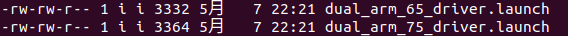

#  具身双臂机器人embodied_arm_driver功能包详解

## **一. **embodied_arm_driver功能包说明

embodied_arm_driver功能包实现了通过 ROS与机械臂进行通信控制机械臂的功能

## 二.embodied_arm_driver功能包架构说明

```
embodied_arm_driver
    ├── CMakeLists.txt
    ├── launch
    │   ├── dual_arm_65_driver.launch 机械臂RM65启动文件
    │   └── dual_arm_75_driver.launch 机械臂RM75启动文件
    ├── package.xml
    ├── ros1具身双臂机器人embodied_arm_driver功能包详解.md
    └── src
        ├── arm_driver.cpp          rm_driver节点源文件
        ├── cJSON.c                 JSON协议文件
        ├── cJSON.h                 JSON协议头文件
        └── rm_robot.h              rm_driver节点头文件

2 directories, 10 files

```

## **三.**embodied_arm_driver功能包使用

### 3.1 **功能包基础使用**

首先配置好环境完成连接后我们可以通过以下命令直接启动节点，控制机械臂。当前的控制基于我们没有改变过机械臂的 IP 即当前机器人左机械臂的 IP 为 169.254.128.18，右机械臂的ip为169.254.128.19，此时默认机器人装配的是RM65机械臂。

```bash
cd ~/embodied_robot
source devel/setup.bash 
roslaunch embodied_arm_driver dual_arm_65_driver.launch 
```

如果机器人装配的RM75机械臂。执行下面命令启动节点：

```
cd ~/embodied_robot
source devel/setup.bash 
roslaunch embodied_arm_driver dual_arm_75_driver.launch 
```

底层驱动启动成功后，将显示以下画面。


底层驱动后，我们可以调用机器人机械臂相关话题去使用它，这里给了机械臂话题调用的[示例包](../../embodied_demo/embodied_arm_demo/)。

### 3.2 **功能包进阶使用**

当我们的机械臂 IP 被改变后我们的启动指令就失效了，再直接使用如上指令就无法成功连接到机械臂了，我们可以通过修改如下配置文件，重新建立连接。

该配置文件位于我们的 embodied_arm_driver 功能包下的 launch 文件夹下。



dual_arm_65_driver.launch文件针对的是RM65臂的

dual_arm_75_driver.launch文件针对的是RM75臂的

dual_arm_65_driver.launch配置文件内容如下：

<launch>

  <!-- 标签 -->
  <arg name="R_Arm_IP"                   default="169.254.128.19"/>    <!-- 设置TCP连接时的IP -->
  <arg name="R_Arm_Port"                 default="8080"/>            <!-- 设置TCP连接时的端口 -->
  <arg name="L_Arm_IP"                   default="169.254.128.18"/>    <!-- 设置TCP连接时的IP -->
  <arg name="L_Arm_Port"                 default="8080"/>            <!-- 设置TCP连接时的端口 -->
  <arg name="Arm_Dof"                  default="6"/>               <!-- 机械臂自由度设置 -->
  <arg name="Arm_Type"                 default="rm65"/>            <!-- 机械臂型号设置 -->
  <arg name="Follow"                   default="false"/>           <!-- 高低跟随设置 false：低跟随 true：高跟随 -->
  <arg name="Udp_IP"                   default="169.254.128.22"/>    <!-- 设置udp主动上报IP -->
  <arg name="R_Udp_Port"                 default="8089"/>            <!-- 设置udp主动上报端口 -->
  <arg name="L_Udp_Port"                 default="8099"/>            <!-- 设置udp主动上报端口 -->
  <arg name="Udp_cycle"                default="5"/>               <!-- 设置udp主动上报周期（ms） 最低为5(200Hz)，需要为5的倍数 -->
  <arg name="Udp_force_coordinate"     default="0"/>               <!-- 设置六维力参考坐标系 -->


  <!-- 启动机械臂底层驱动节点 -->
  <node ns="r_arm" name="arm_driver" pkg="embodied_arm_driver" type="arm_driver" output="screen" respawn="false">
      <!-- 机器人坐标frame -->
      <param name="Arm_IP"                value="$(arg R_Arm_IP)"/> 
      <param name="Arm_Port"              value="$(arg R_Arm_Port)"/>   
      <param name="Arm_Dof"               value="$(arg Arm_Dof)"/>   
      <param name="Arm_Type"              value="$(arg Arm_Type)"/> 
      <param name="Follow"                value="$(arg Follow)"/>  
      <param name="Udp_IP"                value="$(arg Udp_IP)"/>   
      <param name="Udp_Port"              value="$(arg R_Udp_Port)"/>  
      <param name="Udp_cycle"             value="$(arg Udp_cycle)"/>  
      <param name="Udp_force_coordinate"  value="$(arg Udp_force_coordinate)"/>  
      <rosparam param="arm_joints" >[rightarm_joint1, rightarm_joint2, rightarm_joint3, rightarm_joint4, rightarm_joint5, rightarm_joint6]</rosparam>
  </node>

  <!-- 启动机械臂底层驱动节点 -->
  <node ns="l_arm" name="arm_driver" pkg="embodied_arm_driver" type="arm_driver" output="screen" respawn="false">
    <!-- 机器人坐标frame -->
    <param name="Arm_IP"                value="$(arg L_Arm_IP)"/> 
    <param name="Arm_Port"              value="$(arg L_Arm_Port)"/>   
    <param name="Arm_Dof"               value="$(arg Arm_Dof)"/>   
    <param name="Arm_Type"              value="$(arg Arm_Type)"/> 
    <param name="Follow"                value="$(arg Follow)"/>  
    <param name="Udp_IP"                value="$(arg Udp_IP)"/>   
    <param name="Udp_Port"              value="$(arg L_Udp_Port)"/>  
    <param name="Udp_cycle"             value="$(arg Udp_cycle)"/>  
    <param name="Udp_force_coordinate"  value="$(arg Udp_force_coordinate)"/>  
    <rosparam param="arm_joints" >[leftarm_joint1, leftarm_joint2, leftarm_joint3, leftarm_joint4, leftarm_joint5, leftarm_joint6,]</rosparam>
</node>

</launch>


R_Arm_IP：机器人右臂的ip。

R_Arm_Port：机器人右臂设置 TCP 连接时的端口。

L_Arm_IP：机器人左臂的ip。

L_Arm_Port：机器人左臂设置 TCP 连接时的端口。

Arm_Dof: 机械臂自由度设置。6 为 6 自由度，7 为 7 自由度。

Arm_Type：该参数代表机械臂当前的型号，可以选择的参数有 rm65，rm75

Follow：透传跟随效果参数。false：低跟随，true：高跟随。

Udp_IP: 设置 udp 主动上报目标 IP。

Udp_cycle：udp 主动上报周期，需要是 5 的倍数，最低为 5ms(200Hz)。

Udp_Port：设置 udp 主动上报端口。

Udp_force_coordinate：设置系统受力时六维力的基准坐标，0 为传感器坐标系（原

始数据） 1 为当前工作坐标系 2 为当前工具坐标系。

### 3.3 功能包新功能迭代

embodied_arm_driver是具身机器人双臂核心ros包，它是由realman单臂[ros包](https://github.com/RealManRobot/rm_robot) rm_driver包修改而来，如果想使用单臂ros包的新功能，可以参考下面的替换更新步骤:

**原始包 (rm_driver)**：

- **目录结构**：

  ```
  rm_driver/
  ├── CMakeLists.txt
  ├── launch/
  │   ├── rm_63_driver.launch
  │   ├── rm_65_driver.launch
  │   ├── rm_75_driver.launch
  │   ├── rm_eco63_driver.launch
  │   ├── rm_eco65_driver.launch
  │   └── rm_gen72_driver.launch
  ├── package.xml
  └── src/
      ├── cJSON.c
      ├── cJSON.h
      ├── rm_driver.cpp
      └── rm_robot.h
  ```

  功能：控制单只机械臂（支持多种型号，如 RM63、RM65、RM75 等），核心文件：

  - rm_driver.cpp：ROS 节点，处理 TCP/UDP 通信、运动控制、力控、灵巧手、夹爪等。
  - rm_65_driver.launch：启动单臂节点，配置 IP、端口等。
  - cJSON.c、cJSON.h、rm_robot.h：辅助文件，用于 JSON 解析和机械臂通信。

  消息包：使用 rm_msgs。

**目标包 (embodied_arm_driver)**：

- **目录结构**：

  ```
  embodied_arm_driver/
  ├── CMakeLists.txt
  ├── images/
  │   └── launch_driver.png
  ├── launch/
  │   ├── dual_arm_65_driver.launch
  │   └── dual_arm_75_driver.launch
  ├── package.xml
  ├── ros1具身双臂机器人embodied_arm_driver功能包详解.md
  └── src/
      ├── arm_driver.cpp
      ├── cJSON.c
      ├── cJSON.h
      └── rm_robot.h
  ```

  - 功能：控制两只机械臂（右臂和左臂，支持 RM65 和 RM75），核心文件：
    - arm_driver.cpp：基于 rm_driver.cpp 修改，支持双臂控制。
    - dual_arm_65_driver.launch 和 dual_arm_75_driver.launch：启动双臂节点。
    - cJSON.c、cJSON.h、rm_robot.h：与 rm_driver 相同，需要将单臂的这些文件替换过来。
  - 消息包：使用 embodied_arm_msgs（与 单臂机械臂消息ros包rm_msgs只是名称的不同 ）。

  **目标**：将 rm_driver 修改为 embodied_arm_driver，支持双臂控制，适配目标目录结构，保持核心功能（运动、力控等），并处理消息类型差异。

#### 3.3.1 **从 rm_driver 到 embodied_arm_driver 的修改步骤**

步骤 1：将rm_driver包中rm_driver.cpp文件复制到embodied_arm_driver的src文件夹中，删除embodied_arm_driver ros包中arm_driver.cpp，将复制来的rm_driver.cpp名称修改为arm_driver.cpp。

在 rm_driver.cpp 的 main 函数中，替换硬编码的关节名称初始化：

```c++
// 原代码
if(arm_dof == 6)
    {
        real_joint.name.resize(6);
        real_joint.position.resize(6);
        real_joint.name[0] = "joint1";
        real_joint.name[1] = "joint2";
        real_joint.name[2] = "joint3";
        real_joint.name[3] = "joint4";
        real_joint.name[4] = "joint5";
        real_joint.name[5] = "joint6";

        udp_real_joint.name.resize(6);
        udp_real_joint.position.resize(6);
        udp_real_joint.name[0] = "joint1";
        udp_real_joint.name[1] = "joint2";
        udp_real_joint.name[2] = "joint3";
        udp_real_joint.name[3] = "joint4";
        udp_real_joint.name[4] = "joint5";
        udp_real_joint.name[5] = "joint6";
        armState.joint.resize(6);
        Arm_State.joint.resize(6);
        joint_current.joint_current.resize(6);
        udp_joint_error_code.joint.resize(6);
    }
    else if(arm_dof == 7)
    {
        real_joint.name.resize(7);
        real_joint.position.resize(7);
        real_joint.name[0] = "joint1";
        real_joint.name[1] = "joint2";
        real_joint.name[2] = "joint3";
        real_joint.name[3] = "joint4";
        real_joint.name[4] = "joint5";
        real_joint.name[5] = "joint6";
        real_joint.name[6] = "joint7";

        udp_real_joint.name.resize(7);
        udp_real_joint.position.resize(7);
        udp_real_joint.name[0] = "joint1";
        udp_real_joint.name[1] = "joint2";
        udp_real_joint.name[2] = "joint3";
        udp_real_joint.name[3] = "joint4";
        udp_real_joint.name[4] = "joint5";
        udp_real_joint.name[5] = "joint6";
        udp_real_joint.name[6] = "joint7";
        armState.joint.resize(7);
        Arm_State.joint.resize(7);
        joint_current.joint_current.resize(7);
        udp_joint_error_code.joint.resize(7);
    }
```

新代码：

```
    std::vector<std::string> arm_joints;
    if (private_nh_.getParam("arm_joints", arm_joints))
    {
        if (arm_joints.size() == 7)
        {
            for (int i = 0; i < 7; i++)
            {
                real_joint.name[i] = arm_joints[i];
                udp_real_joint.name[i] = arm_joints[i];
                //  ROS_INFO("arm_joints[%d]: %s",  i,  arm_joints[i].c_str());
            }
        }
        if (arm_joints.size() == 6)
        {
            for (int i = 0; i < 6; i++)
            {
                real_joint.name[i] = arm_joints[i];
                udp_real_joint.name[i] = arm_joints[i];
                //  ROS_INFO("arm_joints[%d]: %s",  i,  arm_joints[i].c_str());
            }
        }
    }
    else
    {
        ROS_ERROR("Arm_joints was not read from launch!!!");
    }
```

注意，需要将单臂的机械臂消息包rm_msgs移植到embodied_arm文件夹下替换为embodied_arm_msgs 这两个包，除了包名称不同其余消息的类型等等都一样。

将arm_driver.cpp中的信息包替换为embodied_arm_msgs

#### 3.3.2 从单臂 rm_65_driver.launch 到双臂 dual_arm_65_driver.launch 的修改过程

##### 步骤 1：明确目标

- 单臂启动文件 (rm_65_driver.launch)：
  - 启动一个 rm_driver 节点，控制单只机械臂（例如 RM65）。
  - 配置参数：Arm_IP、Arm_Port、Arm_Dof、Arm_Type 等，适用于单臂。
  - 节点运行在默认命名空间下，话题如 /rm_driver/MoveJ_Cmd。
- 双臂启动文件 (dual_arm_65_driver.launch)：
  - 启动两个 arm_driver 节点，分别控制右臂和左臂（RM65）。
  - 使用命名空间 r_arm 和 l_arm 区分两臂，话题如 /r_arm/rm_driver/MoveJ_Cmd 和 /l_arm/rm_driver/MoveJ_Cmd。
  - 为每只臂配置独立的 Arm_IP、Udp_Port 和 arm_joints 参数。
  - 保留单臂的所有参数（如 Udp_cycle、Follow 等），并扩展为双臂。

##### 步骤 2：创建双臂启动文件

1. 复制单臂启动文件：

   假设rm_driver包中rm_65_driver.launch的内容如下：

   ```xml
   <launch>
   
       <!-- 标签 -->
       <arg name="Arm_IP"                   default="192.168.1.18"/>    <!-- 设置TCP连接时的IP -->
       <arg name="Arm_Port"                 default="8080"/>            <!-- 设置TCP连接时的端口 -->
       <arg name="Arm_Dof"                  default="6"/>               <!-- 机械臂自由度设置 -->
       <arg name="Arm_Type"                 default="RM65"/>            <!-- 机械臂型号设置 -->
       <arg name="Follow"                   default="false"/>           <!-- 高低跟随设置 false：低跟随 true：高跟随 -->
       <arg name="Udp_IP"                   default="192.168.1.10"/>    <!-- 设置udp主动上报IP -->
       <arg name="Udp_Port"                 default="8089"/>            <!-- 设置udp主动上报端口 -->
       <arg name="Udp_cycle"                default="5"/>               <!-- 设置udp主动上报周期（ms） 最低为5(200Hz)，需要为5的倍数 -->
       <arg name="Udp_force_coordinate"     default="0"/>               <!-- 设置六维力参考坐标系 -->
       <arg name="Udp_hand"                 default="false"/>           <!-- 设置灵巧手udp主动上报使能 -->
       <arg name="trajectory_mode"          default="0"/>               <!-- 设置高跟随模式下，支持多种模式，0-完全透传模式、1-曲线拟合模式、2-滤波模式-->
       <arg name="radio"                    default="0"/>               <!-- 设置曲线拟合模式下平滑系数（范围0-100）或者滤波模式下的滤波参数（范围0-1000），数值越大表示平滑效果越好-->         
   
       <!-- 启动机械臂底层驱动节点 -->
       <node name="rm_driver" pkg="rm_driver" type="rm_driver" output="screen" respawn="false">
           <!-- 机器人参数 -->
           <param name="Arm_IP"                value="$(arg Arm_IP)"/> 
           <param name="Arm_Port"              value="$(arg Arm_Port)"/>   
           <param name="Arm_Dof"               value="$(arg Arm_Dof)"/>   
           <param name="Arm_Type"              value="$(arg Arm_Type)"/> 
           <param name="Follow"                value="$(arg Follow)"/>  
           <param name="Udp_IP"                value="$(arg Udp_IP)"/>   
           <param name="Udp_Port"              value="$(arg Udp_Port)"/>  
           <param name="Udp_cycle"             value="$(arg Udp_cycle)"/>  
           <param name="Udp_force_coordinate"  value="$(arg Udp_force_coordinate)"/>  
           <param name="Udp_hand"              value="$(arg Udp_hand)"/>
           <param name="trajectory_mode"       value="$(arg trajectory_mode)"/>
           <param name="radio"                 value="$(arg radio)"/>
       </node>
   
   </launch>
   
   
   ```

   

   - 在 embodied_arm_driver/launch/ 目录下，复制 rm_driver包中rm_65_driver.launch 为 dual_arm_65_driver.launch：

2. 修改 dual_arm_65_driver.launch：

   打开 embodied_arm_driver/launch/dual_arm_65_driver.launch，替换为以下内容，基于单臂文件扩展为双臂：

   ```xml
   <launch>
            <!-- 右臂参数 -->
            <arg name="R_Arm_IP"                default="169.254.128.19"/>    <!-- 右臂 TCP IP -->
            <arg name="R_Arm_Port"              default="8080"/>            <!-- 右臂 TCP 端口 -->
            <arg name="R_Udp_Port"              default="8089"/>            <!-- 右臂 UDP 端口 -->
            <!-- 左臂参数 -->
            <arg name="L_Arm_IP"                default="169.254.128.18"/>    <!-- 左臂 TCP IP -->
            <arg name="L_Arm_Port"              default="8080"/>            <!-- 左臂 TCP 端口 -->
            <arg name="L_Udp_Port"              default="8099"/>            <!-- 左臂 UDP 端口 -->
            <!-- 通用参数 -->
            <arg name="Arm_Dof"                 default="6"/>               <!-- 机械臂自由度 -->
            <arg name="Arm_Type"                default="RM65"/>            <!-- 机械臂型号 -->
            <arg name="Follow"                  default="false"/>           <!-- 高低跟随 -->
            <arg name="Udp_IP"                  default="169.254.128.22"/>    <!-- UDP 目标 IP -->
            <arg name="Udp_cycle"               default="5"/>               <!-- UDP 周期（ms） -->
            <arg name="Udp_force_coordinate"    default="0"/>               <!-- 六维力坐标系 -->
            <arg name="Udp_hand"                default="false"/>           <!-- 灵巧手 UDP -->
            <arg name="Udp_plus_state"          default="false"/>           <!-- 末端设备状态 -->
            <arg name="Udp_plus_base"           default="false"/>           <!-- 末端设备基础信息 -->
            <arg name="trajectory_mode"         default="0"/>               <!-- 高跟随模式 -->
            <arg name="radio"                   default="0"/>               <!-- 平滑系数 -->
   
            <!-- 右臂节点 -->
            <node ns="r_arm" name="arm_driver" pkg="embodied_arm_driver" type="arm_driver" output="screen" respawn="false">
                <param name="Arm_IP"                value="$(arg R_Arm_IP)"/>
                <param name="Arm_Port"              value="$(arg R_Arm_Port)"/>
                <param name="Arm_Dof"               value="$(arg Arm_Dof)"/>
                <param name="Arm_Type"              value="$(arg Arm_Type)"/>
                <param name="Follow"                value="$(arg Follow)"/>
                <param name="Udp_IP"                value="$(arg Udp_IP)"/>
                <param name="Udp_Port"              value="$(arg R_Udp_Port)"/>
                <param name="Udp_cycle"             value="$(arg Udp_cycle)"/>
                <param name="Udp_force_coordinate"  value="$(arg Udp_force_coordinate)"/>
                <param name="Udp_hand"              value="$(arg Udp_hand)"/>
                <param name="Udp_plus_state"        value="$(arg Udp_plus_state)"/>
                <param name="Udp_plus_base"         value="$(arg Udp_plus_base)"/>
                <param name="trajectory_mode"       value="$(arg trajectory_mode)"/>
                <param name="radio"                 value="$(arg radio)"/>
                <rosparam param="arm_joints">[rightarm_joint1, rightarm_joint2, rightarm_joint3, rightarm_joint4, rightarm_joint5, rightarm_joint6]</rosparam>
            </node>
   
            <!-- 左臂节点 -->
            <node ns="l_arm" name="arm_driver" pkg="embodied_arm_driver" type="arm_driver" output="screen" respawn="false">
                <param name="Arm_IP"                value="$(arg L_Arm_IP)"/>
                <param name="Arm_Port"              value="$(arg L_Arm_Port)"/>
                <param name="Arm_Dof"               value="$(arg Arm_Dof)"/>
                <param name="Arm_Type"              value="$(arg Arm_Type)"/>
                <param name="Follow"                value="$(arg Follow)"/>
                <param name="Udp_IP"                value="$(arg Udp_IP)"/>
                <param name="Udp_Port"              value="$(arg L_Udp_Port)"/>
                <param name="Udp_cycle"             value="$(arg Udp_cycle)"/>
                <param name="Udp_force_coordinate"  value="$(arg Udp_force_coordinate)"/>
                <param name="Udp_hand"              value="$(arg Udp_hand)"/>
                <param name="Udp_plus_state"        value="$(arg Udp_plus_state)"/>
                <param name="Udp_plus_base"         value="$(arg Udp_plus_base)"/>
                <param name="trajectory_mode"       value="$(arg trajectory_mode)"/>
                <param name="radio"                 value="$(arg radio)"/>
                <rosparam param="arm_joints">[leftarm_joint1, leftarm_joint2, leftarm_joint3, leftarm_joint4, leftarm_joint5, leftarm_joint6]</rosparam>
            </node>
        </launch>
   ```

   

##### 步骤 3：关键修改点说明

1. **参数扩展**：

   - **单臂**：所有参数（如 `Arm_IP`、`Udp_Port`）只适用于一只机械臂。

   - **双臂**：

     - 拆分 `Arm_IP` 为 `R_Arm_IP` 和 `L_Arm_IP`，分别配置右臂和左臂的 IP（例如 `192.168.1.18` 和 `192.168.1.19`）。

     - 拆分 `Udp_Port` 为 `R_Udp_Port` 和 `L_Udp_Port`，避免端口冲突（例如 `8089` 和 `8099`）。

     - 保留其他参数（如 `Arm_Dof`、`Udp_cycle`）为通用参数，适用于两臂。
2. **节点扩展**：
   - **单臂**：启动一个 `rm_driver` 节点（`pkg="rm_driver" type="rm_driver"`）。
   - **双臂**：
     - 启动两个 `arm_driver` 节点（`pkg="embodied_arm_driver" type="arm_driver"`）。
     - 使用命名空间 `ns="r_arm"` 和 `ns="l_arm"`，确保话题隔离（如 `/r_arm/rm_driver/MoveJ_Cmd` 和 `/l_arm/rm_driver/MoveJ_Cmd`）。
     - 节点名统一为 `arm_driver`，与 `embodied_arm_driver` 的可执行文件一致。
3. **添加关节名称参数**：
- **单臂**：`rm_driver.cpp` 通常硬编码关节名称（如 `joint1` 到 `joint6`）。

- **双臂**：

  - 添加 `arm_joints` 参数，动态指定关节名称：
    - 右臂：`[rightarm_joint1, rightarm_joint2, ...]`
    - 左臂：`[leftarm_joint1, leftarm_joint2, ...]`

  - 这需要 `arm_driver.cpp` 支持从参数服务器读取 `arm_joints`（已在之前的上下文中确认）。

##### 步骤 4：验证修改

1. **保存文件**：
   - 确保 `dual_arm_65_driver.launch` 已保存在 `embodied_arm_driver/launch/`。
2. **测试启动**：

   - 运行双臂启动文件：

     ```bash
     roslaunch embodied_arm_driver dual_arm_65_driver.launch
     ```

     
