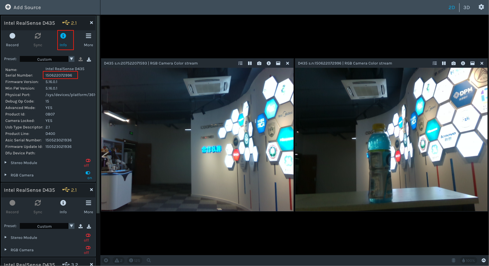
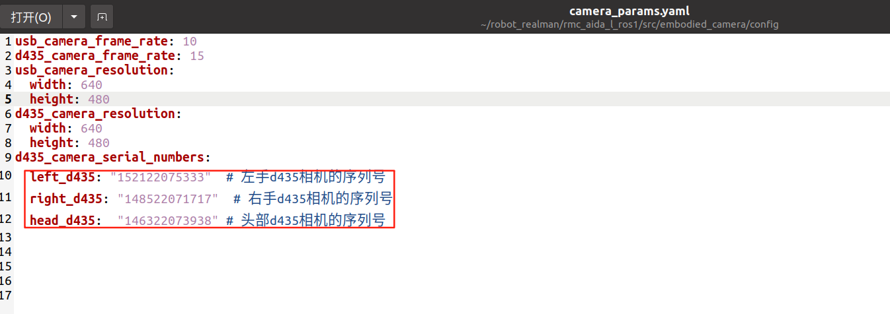
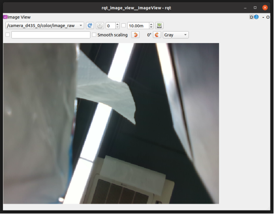

#  具身双臂机器人embodied_camera功能包详解


## **一. **embodied_camera功能包说明

embodied_camera 是一个为ROS1环境设计的相机管理功能包，专门用于处理具身机器人系统中的多个USB摄像头和RealSense D435相机的图像流发布，用户可以订阅相关话题来获取d435相机和usb相机图像流数据。

## 二.embodied_camera功能包架构说明

```
embodied_camera
├── CMakeLists.txt
├── config
│   └── camera_params.yaml usb相机和d435相机配置文件
├── launch
│   ├── d435_camera_pub.launch d435相机启动文件
│   └── usb_camera_pub.launch usb 相机启动文件
├── package.xml
├── ros1具身双臂机器人embodied_camera功能包详解.docx
└── scripts
    ├── multi_d435_publisher.py  d435相机启动节点文件
    └── multi_usb_cam_publisher.py usb相机启动节点文件
```


## **三.**embodied_camera功能包使用

首先**环境配置和ros包编译完成**完成后我们可以直接通过以下命令直接启动d435相机和usb相机。

### 配置相机设备参数

- 使用realsense-viewer工具查看左右手相机和头部相机的设备号

  

- 打开ros包config文件夹下配置文件camera_params.yaml，并写入到对应位置

  


### 发布D435相机数据

打开一个终端进入**具身ros包**的工作空间，执行以下命令运行embodied_camera功能包发布相机话题：

```
cd ~/embodied_robot
source devel/setup.bash
roslaunch embodied_camera d435_camera_pub.launch
```

此时会发布具身机器人左手、右手和头部三个d435相机的相机数据。

打开另一个终端，执行下面命令查看上面命令发布的d435相机数据：

```
rqt_image_view
```

此时会弹出一个弹窗，点击弹窗左上角下拉框查看d435的颜色图像和深度图像。




### 发布USB相机数据

打开一个终端进入具身ros包的工作空间，启动下面命令发布具身机器人顶部usb相机数据：

```
cd ~/embodied_robot
source devel/setup.bash
roslaunch embodied_camera usb_camera_pub.launch
```


## 四.embodied_camera功能包话题

| 话题名称                       | 消息类型          | 描述                             |
| ------------------------------ | ----------------- | -------------------------------- |
| /camera_d435_0/color/image_raw | sensor_msgs/Image | 具身机器人左手D435相机的彩色图像 |
| /camera_d435_0/depth/image_raw | sensor_msgs/Image | 具身机器人左手D435相机的深度图像 |
| /camera_d435_1/color/image_raw | sensor_msgs/Image | 具身机器人右手D435相机的彩色图像 |
| /camera_d435_1/depth/image_raw | sensor_msgs/Image | 具身机器人右手D435相机的深度图像 |
| /camera_d435_2/color/image_raw | sensor_msgs/Image | 具身机器人头部D435相机的彩色图像 |
| /camera_d435_2/depth/image_raw | sensor_msgs/Image | 具身机器人头部D435相机的深度图像 |
| /camera0/image_raw             | sensor_msgs/Image | 具身机器人usb相机1彩色图像       |
| /camera1/image_raw             | sensor_msgs/Image | 具身机器人usb相机2彩色图像       |


## 五.具身机器人相机二次开发

参考以下链接d435官方ros包进行二次开发：

· **Intel RealSense ROS Wrapper (GitHub)**
		ROS1官方包，支持D435相机，提供安装、配置和多相机示例。
		链接: https://github.com/IntelRealSense/realsense-ros/tree/ros1-legacy
		建议: 使用ros1-legacy分支，查看README.md和launch文件夹中的	rs_multiple_devices.launch。

· **Intel RealSense SDK 2.0 (librealsense)**
		D435底层驱动，ROS包依赖。
		链接: https://github.com/IntelRealSense/librealsense
		建议: 安装v2.39.0+（参考doc/installation.md），确保固件版本为5.13.0.50+。

· **ROS Wiki: realsense2_camera**
		ROS1（Noetic/Melodic）包说明，包含话题、参数和依赖信息。
		链接: http://wiki.ros.org/realsense2_camera
		建议: 查看“Parameters”和“Published Topics”以了解RGB、深度、点云和IMU话题。

· **Multiple Camera Setup Tutorial**
		官方教程，讲解ROS1下多D435相机配置和点云整合。
		链接: https://www.intelrealsense.com/how-to-multiple-camera-setup-with-ros/
		建议: 参考配置serial_no和命名空间，避免话题冲突。
