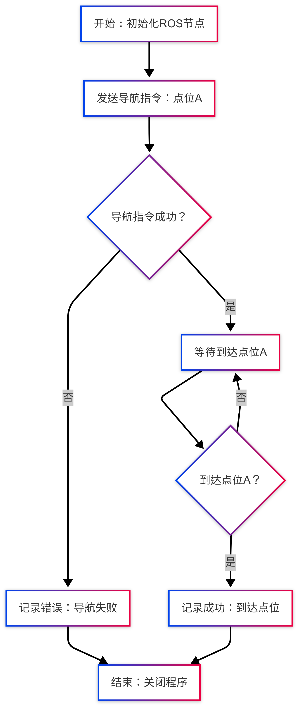

# 具身双臂机器人embodied_agv_demo底盘控制演示包详解

## 一.embodied_agv_demo底盘控制演示包说明

具身机器人的底盘控制程序部署在底盘主机上，embodied_agv_demo演示包主要演示一个控制底盘移动的示例。该示例展示了如何通过调用悟时（WOOSH）底盘的ROS接口实现导航到指定点位的功能。

## 二.embodied_agv_demo底盘控制演示包架构说明

```
embodied_agv_demo
    ├── CMakeLists.txt
    ├── package.xml
    ├── ros1具身双臂机器人embodied_agv_demo底盘控制演示包详解.md
    └── scripts
        └── agv_demo.py 底盘控制的示例脚本
```


## 三.embodied_agv_demo底盘控制演示包使用

### 3.1 启动前准备

1.使用前请参考[《移动机器人的ROS接口（对外） - WOOSH Robotics.pdf》](../../embodied_hardware_docs/robot_chassis/移动机器人的ROS接口（对外） - WOOSH Robotics.pdf)_进行环境变量配置（默认**出厂已经配置好**）

2.建图并设置点位"A"。

- 建图请看[Woosh Mobile 软件建图](../../embodied_hardware_docs/robot_chassis/Woosh Mobile User Guide_ZH.pdf)操作
- 设置点位请看[Woosh Design 软件编辑点位](../../embodied_hardware_docs/robot_chassis/Woosh Design User Guide_ZH.pdf)操作
- 建图和设置点位相关的软件请在这个[链接下](https://seafile.wsrobotics.com/d/4482d733b38045f6846a/?p=%2F%E4%BA%A7%E5%93%81%E8%BD%AF%E4%BB%B6%E5%AE%89%E8%A3%85%E5%8C%85&mode=list)下载

### 3.2 运行embodied_agv_demo底盘控制演示包

首先环境配置和ros包编译完成完成后，打开一个终端进入具身ros包的工作空间，我们通过以下命令启动底盘控制演示包：

```
cd ~/embodied_robot
source devel/setup.bash
rosrun  embodied_agv_demo agv_demo.py
```

执行上述命令后，底盘将自动移动到地图上已设置的点位"A"对应的地点。程序将监控底盘状态，并在到达目标点位后输出成功信息。

这个示例仅展示了基本的点位导航功能，上述命令执行后的逻辑流程图如下：



## 四.注意事项

- 使用前必须确保已正确设置点位"A"

- 该示例仅展示了基本的点位导航功能，更多底盘功能请参考[《移动机器人的ROS接口（对外） - WOOSH Robotics.pdf》](../../embodied_hardware_docs/robot_chassis/移动机器人的ROS接口（对外） - WOOSH Robotics.pdf)_

