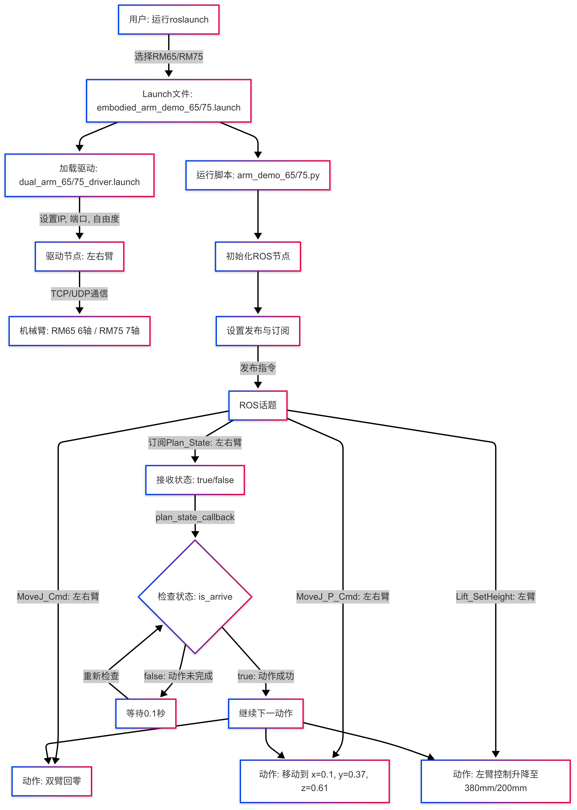

#  ros1具身双臂机器人机械臂控制演示包embodied_arm_demo详解


## **一. **机械臂控制演示包embodied_arm_demo说明

`embodied_arm_demo`是一个ROS1功能包，旨在提供具身双臂机器人机械臂控制和升降机构操作的演示。用户可通过该包测试机械臂关节空间运动（MoveJ）、笛卡尔空间运动（MoveJ_P）和升降控制功能。

## **二. **机械臂控制演示包embodied_arm_demo架构说明

```
embodied_arm_demo/                             # ROS1具身双臂机器人机械臂控制演示包根目录
    ├── CMakeLists.txt                         # CMake配置文件，定义包的构建规则、依赖和脚本安装
    ├── package.xml                            # ROS包的元数据文件，声明包的名称、版本、依赖和描述
    ├── ros1具身双臂机器人embodied_arm_demo机械臂控制演示包详解.md  # 包的使用说明文档，详述功能、架构、使用方法和注意事项
    ├── launch/                                # Launch文件目录，存放ROS启动文件
    │   ├── embodied_arm_demo_65.launch        # Launch文件，用于启动RM65双臂机械臂驱动和arm_demo_65.py脚本
    │   └── embodied_arm_demo_75.launch        # Launch文件，用于启动RM75双臂机械臂驱动和arm_demo_75.py脚本
    ├── scripts/                               # Python脚本目录，存放机械臂控制演示脚本
    │   ├── arm_demo_65.py                    # Python脚本，控制RM65（6轴）双臂机械臂和升降机构，包含关节和笛卡尔运动演示
    │   └── arm_demo_75.py                    # Python脚本，控制RM75（7轴）双臂机械臂和升降机构，包含关节和笛卡尔运动演示
    └── src/                                   # 源代码目录，当前为空，可用于存放C++或其他源文件

    3 directories, 7 files
```


## **三.**机械臂控制演示包embodied_arm_demo使用

完成环境配置和ROS包编译后，可通过以下命令运行演示包

打开一个终端进入ros包的工作空间，让机械臂执行关节运动和机器人升降机构执行运动：

如果机器人配置的rm65臂，执行下面指令：

```bash
cd ~/embodied_robot
source devel/setup.bash
roslaunch embodied_arm_demo embodied_arm_demo_65.launch
```

如果机器人配置的rm75臂，执行下面指令：

```
cd ~/embodied_robot
source devel/setup.bash
roslaunch embodied_arm_demo embodied_arm_demo_75.launch
```

执行上面命令后运行效果：

- 左右机械臂回零（关节角度0°，末端57°）。
- 升降机构依次调整至380mm和200mm。

上面执行过程中逻辑流程图如下：



## 四.进阶使用

上面示例只是展示机械臂的关节运动和升降机构，如需使用双臂的更多功能（如力控、夹爪操作、状态反馈等）请参考[单臂机器人话题说明](../../embodied_hardware_docs/robotic_arm/睿尔曼机械臂ROS1rm_driver话题详细说明V1.0.0-4.pdf)。

具身的双臂话题名称在单臂基础上添加了左臂前缀/l_arm和右臂前缀/r_arm，其余参数和逻辑完全一致。
例如，实现movej关节运动话题区别：

- 单臂示例：`/rm_driver/MoveJ_Cmd`
- 具身机器人双臂左臂：`/l_arm/rm_driver/MoveJ_Cmd`
- 具身机器人双臂右臂：`/r_arm/rm_driver/MoveJ_Cmd`


