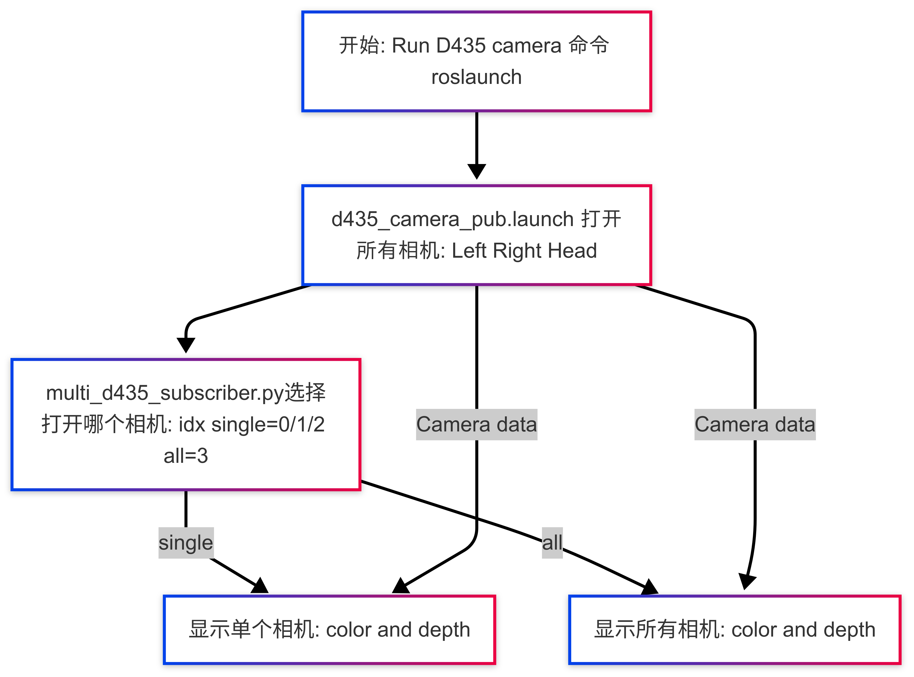
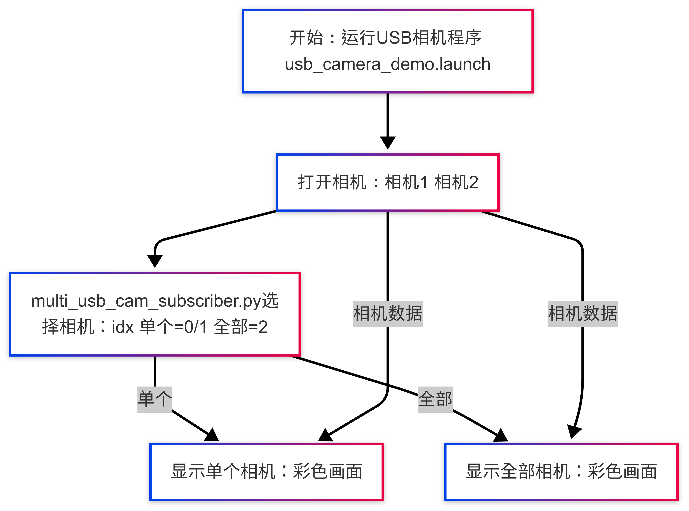

#  ros1具身双臂机器人相机控制演示包embodied_camera_demo详解


## **一. **相机控制演示包embodied_camera_demo说明

相机控制演示包 embodied_camera_demo通过调用embodied_camera功能包里的话题来显示d435相机和usb相机图像。

## **二. **相机控制演示包embodied_camera_demo架构说明

```
embodied_camera_demo
    ├── CMakeLists.txt
    ├── launch
    │   ├── d435_camera_demo.launch D435相机使用launch文件
    │   └── usb_camera_demo.launch usb相机使用launch文件
    ├── package.xml
    ├── ros1具身双臂机器人embodied_camera_demo相机控制演示包详解.md
    └── scripts
        ├── multi_d435_subscriber.py D435相机图像处理脚本
        └── multi_usb_cam_subscriber.py USB相机图像处理脚本

2 directories, 7 files

```


## **三.**相机控制演示包embodied_camera_demo使用

 运行这个demo前需要确保三个d435相机设备号已经配置到embodied_camera包的配置文件中去，如若不清楚请查看[配置](../../embodied_camera/ros1具身双臂机器人embodied_camera功能包详解.md)。

首先**环境配置和ros包编译完成**完成后我们可以直接通过以下命显示d435相机和usb相机图像。

### 显示D435相机图像

打开一个终端进入ros包的工作空间，执行以下命令发布和显示d435相机数据：

```bash
cd ~/embodied_robot
source devel/setup.bash
roslaunch embodied_camera_demo d435_camera_demo.launch
```

此时默认会发布和显示左手、右手和头部d435相机的颜色图和深度图。如果我们想显示左手d435的图像，在后面加上命令idx:=0，如下：

```bash
roslaunch embodied_camera_demo d435_camera_demo.launch idx:=0
```

idx命令和d435相机的对应关系如下：

| idx  | 对应的d435相机   |
| ---- | ---------------- |
| 0    | 左手上的d435相机 |
| 1    | 右手上的d435相机 |
| 2    | 头部的d435相机   |
| 3    | 所有的d435相机   |

命令的逻辑流程图如下：


### 显示usb相机图像

打开一个终端进入ros包的工作空间，启动下面命令发布和显示usb相机数据：

```
cd ~/embodied_robot
source devel/setup.bash
roslaunch embodied_camera_demo usb_camera_demo.launch
```

此时默认会发布并显示具身机器人升降平台顶部前后两个usb相机颜色图。如果我们想显示其中一个usb相机的颜色图像，在后面加上命令idx:=0，如下：

```
roslaunch embodied_camera_demo usb_camera_demo.launch idx:=0
```

idx命令和d435相机的对应关系如下：

| idx  | 对应的usb相机 |
| ---- | ------------- |
| 0    | usb相机1      |
| 1    | usb相机2      |
| 2    | 全部的usb相机 |

上面命令的逻辑示意图如下：


