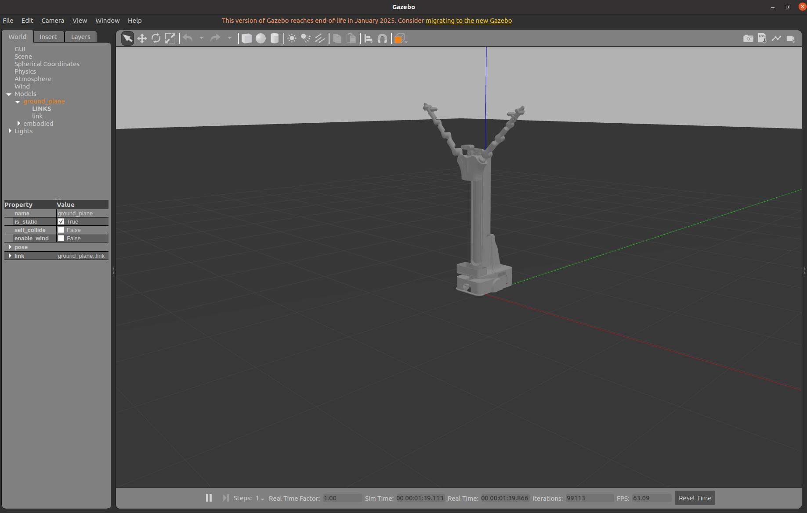
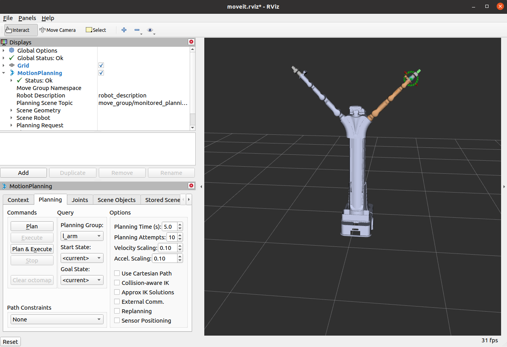

#  ros1具身双臂机器人embodied_gazebo功能包详解


## **一. **embodied_gazebo功能包说明

embodied_gazebo用于在 Gazebo 仿真环境中模拟双臂机器人系统。它支持两种机械臂类型（rm65 和 rm75）和两种末端执行器（rmg24 夹爪和 aoyi）。仿真环境为零重力，由 no_gravity_world.world 文件定义。该功能包包含启动文件、配置文件和世界文件，用于设置仿真环境、控制机器人关节以及通过 MoveIt 实现机械臂运动规划和执行。

## **二. **embodied_gazebo功能包架构说明

```
embodied_gazebo
    ├── CMakeLists.txt
    ├── config #包含关节状态和轨迹控制器的 YAML 配置文件。
    │   ├── arm_gazebo_joint_states.yaml
    │   ├── rm_trajectory_control_rm65_aoyi.yaml
    │   ├── rm_trajectory_control_rm65_rmg24.yaml
    │   ├── rm_trajectory_control_rm75_aoyi.yaml
    │   └── rm_trajectory_control_rm75_rmg24.yaml
    ├── launch #含启动 Gazebo、控制器和 MoveIt 的 ROS 启动文件。
    │   ├── arm_bringup_moveit.launch #主启动文件，用于启动整个仿真，包括 Gazebo、ROS 控制器和 MoveIt。
    │   ├── arm_gazebo_states.launch #配置并启动关节状态控制器和机器人状态发布器。
    │   ├── arm_trajectory_controller.launch #启动 Gazebo 仿真，加载指定的世界和机器人模型。
    │   └── arm_world.launch #启动 Gazebo 仿真，加载指定的世界和机器人模型。
    ├── package.xml
    ├── ros1具身双臂机器人embodied_gazebo功能包详解.md
    └── worlds
        └── no_gravity_world.world #定义一个零重力的 Gazebo 世界。


```

## **三.**embodied_gazebo功能包使用

### 3.1 moveit控制虚拟机械臂

完成环境配置和ROS包编译后，通过以下命令进行embodied_gazebo功能包的运行：

```bash
cd ~/embodied_robot
source devel/setup.bash
roslaunch embodied_gazebo arm_bringup_moveit.launch 
```

运行成功后将弹出如下界面:



弹出 rviz 的控制界面后就可以进行 Moveit 和 gazebo 的仿真控制了。



上面指令默认对应的是RM65-B机械臂和rmg24夹爪，如果当前具身机器人配置的RM75-B机械臂和傲意灵巧手，可在上面运行命令后面指定下面参数。

支持的配置参数如下表所示：

| 参数名         | 可选值  | 说明                      |
| -------------- | ------- | ------------------------- |
| `arm_type`     | `rm65`  | 配置RM65机械臂（6自由度） |
|                | `rm75`  | 配置RM75机械臂（7自由度） |
| `end_effector` | `rmg24` | 末端为RMG24夹爪           |
|                | `aoyi`  | 末端为AOYI灵巧手          |

### **修改参数示例**

例如需机器人使用 RM65 机械臂和 aoyi 灵巧手，可运行：

```bash
roslaunch embodied_gazebo arm_bringup_moveit.launch  arm_type:=rm65 end_effector:=aoyi
```

