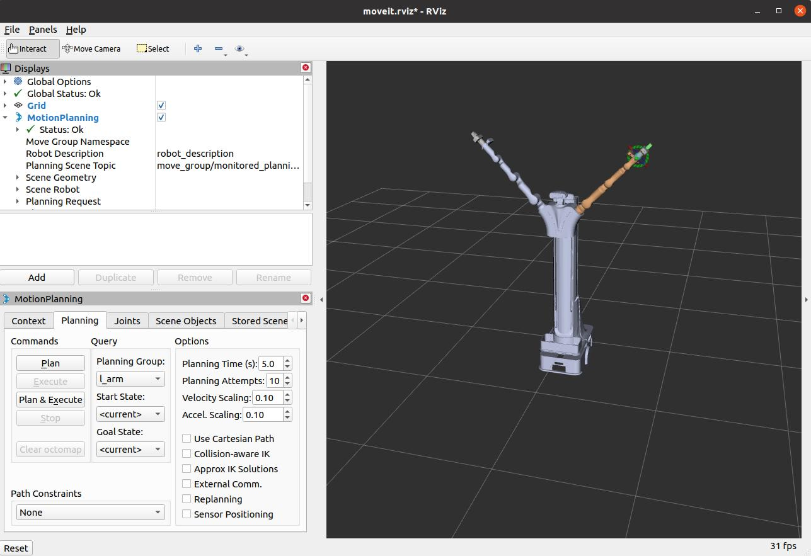
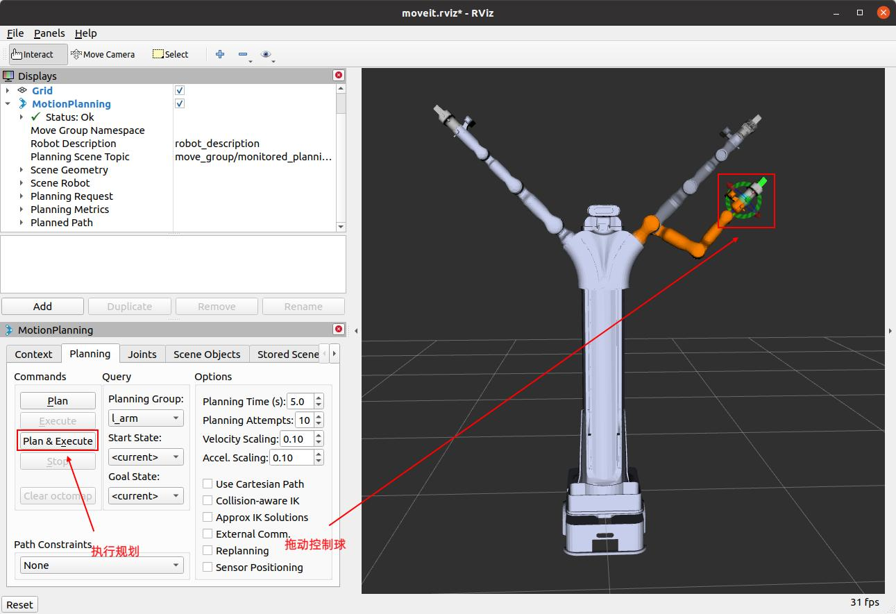
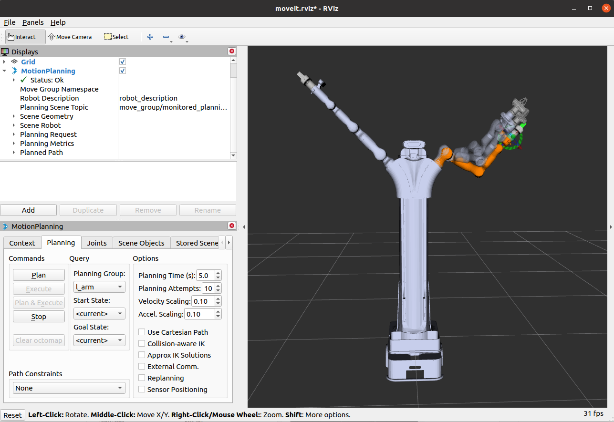
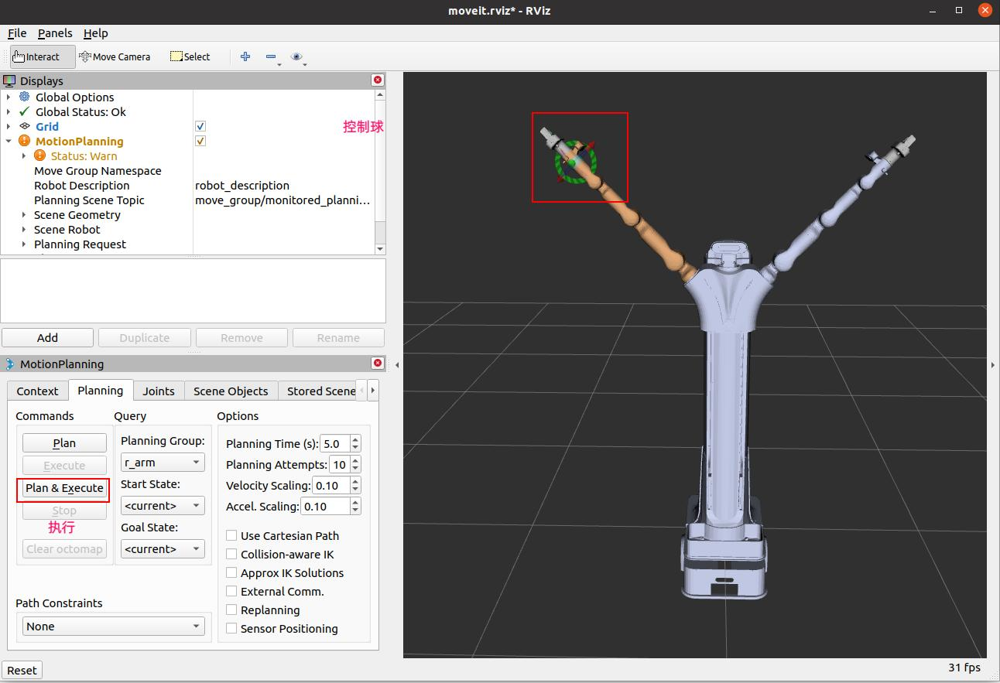

#  ros1具身双臂机器人embodied_moveit功能包详解


## **一. **embodied_moveit功能包说明

embodied_moveit 功能包集成了 MoveIt 运动规划框架，用于控制具身双臂机器人的真实和虚拟机械臂。该功能包基于机器人 URDF 描述（支持 rm75-B/rm65-B 机械臂及 RMG24 夹爪等末端执行器），生成适配的 MoveIt 配置文件和启动文件，支持以下功能：

- 运动规划和逆运动学求解，适用于单臂和双臂协同操作。
- 虚拟机械臂和夹爪的 Gazebo 仿真控制（结合 embodied_gazebo 功能包）。
- 真实机械臂的路径规划与执行。

## **二. **embodied_moveit功能包架构说明

```
embodied_moveit
    ├── CMakeLists.txt
    ├── config
    │   ├── cartesian_limits.yaml
    │   ├── chomp_planning.yaml
    │   ├── fake_controllers.yaml
    │   ├── gazebo_controllers.yaml
    │   ├── gazebo_robot_description.urdf
    │   ├── joint_limits_rm65_aoyi.yaml
    │   ├── joint_limits_rm65_rmg24.yaml
    │   ├── joint_limits_rm75_aoyi.yaml
    │   ├── joint_limits_rm75_rmg24.yaml
    │   ├── kinematics.yaml
    │   ├── ompl_planning.yaml
    │   ├── robot_description_rm65_aoyi.srdf
    │   ├── robot_description_rm65_rmg24.srdf
    │   ├── robot_description_rm75_aoyi.srdf
    │   ├── robot_description_rm75_rmg24.srdf
    │   ├── ros_controllers.yaml
    │   ├── sensors_3d.yaml
    │   ├── simple_moveit_controllers.yaml
    │   └── stomp_planning.yaml
    ├── launch
    │   ├── chomp_planning_pipeline.launch.xml
    │   ├── default_warehouse_db.launch
    │   ├── demo_gazebo.launch
    │   ├── demo.launch 启动 MoveIt 的仿真环境
    │   ├── demo_realrobot.launch 面向真实机器人的演示启动文件，直接与实际硬件交互。
    │   ├── fake_moveit_controller_manager.launch.xml
    │   ├── gazebo.launch
    │   ├── joystick_control.launch
    │   ├── move_group.launch 启动 MoveIt 的核心运动规划节点
    │   ├── moveit_planning_execution.launch 用于实际机器人的整体启动
    │   ├── moveit.rviz
    │   ├── moveit_rviz.launch
    │   ├── ompl-chomp_planning_pipeline.launch.xml
    │   ├── ompl_planning_pipeline.launch.xml
    │   ├── pilz_industrial_motion_planner_planning_pipeline.launch.xml
    │   ├── planning_context.launch
    │   ├── planning_pipeline.launch.xml
    │   ├── robot_description_moveit_sensor_manager.launch.xml
    │   ├── ros_controllers.launch
    │   ├── ros_control_moveit_controller_manager.launch.xml
    │   ├── run_benchmark_ompl.launch
    │   ├── sensor_manager.launch.xml
    │   ├── setup_assistant.launch
    │   ├── simple_moveit_controller_manager.launch.xml
    │   ├── stomp_planning_pipeline.launch.xml
    │   ├── trajectory_execution.launch.xml
    │   ├── warehouse.launch
    │   └── warehouse_settings.launch.xml
    ├── package.xml
    └── ros1具身双臂机器人embodied_moveit功能包详解.md


```

## **三.**embodied_moveit功能包使用

### 3.1 moveit控制虚拟机械臂

完成环境配置和ROS包编译后，通过以下命令启动启动节点：

```bash
cd ~/embodied_robot
source devel/setup.bash
roslaunch embodied_moveit demo.launch
```

上述命令使用默认参数：

```bash
arm_type:=rm65 end_effector:=rmg24
```

节点启动成功后，将显示以下画面。



接下来我们可以通过拖动控制球使机械臂到达目标位置，然后点击规划执行。





### **参数配置**

支持的配置参数如下表所示：

| 参数名         | 可选值  | 说明                      |
| -------------- | ------- | ------------------------- |
| `arm_type`     | `rm65`  | 配置RM65机械臂（6自由度） |
|                | `rm75`  | 配置RM75机械臂（7自由度） |
| `end_effector` | `rmg24` | 末端为RMG24夹爪           |
|                | `aoyi`  | 末端为AOYI灵巧手          |

### **修改参数示例**

例如需机器人使用 RM75 机械臂和 aoyi 灵巧手，可运行：

```
roslaunch embodied_moveit demo.launch arm_type:=rm75 end_effector:=aoyi
```

节点启动成功后，将显示以下画面：


### 3.2 moveit控制真实机械臂

控制真实机械臂需要的控制指令如下：

```bash
cd ~/embodied_robot
source devel/setup.bash
roslaunch embodied_moveit moveit_planning_execution.launch
```

完成以上操作后将会出现以下界面，我们可以通过拖动控制球的方式控制机械臂运动。



当前默认机械臂是RM65 ，末端工具是rmg24夹爪，如果当前机械臂配置的机械臂不是RM65或末端工具不为rmg24夹爪，则需要在上面命令后面加上arm_type和end_effector来指定具体型号，如：

```bash
roslaunch embodied_moveit moveit_planning_execution.launch arm_type:=rm75 end_effector:=aoyi
```

